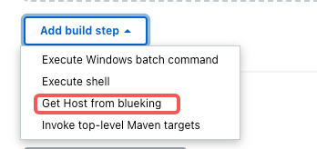
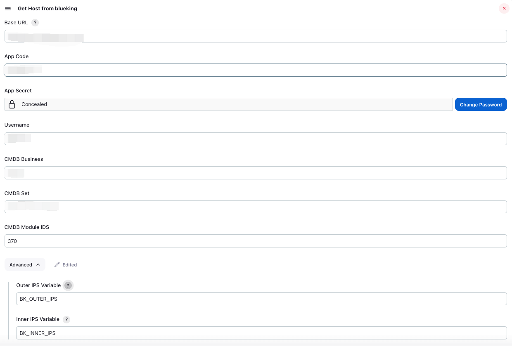

# Jenkins BlueKing Plugin

## 介绍

此插件为Jenkins提供与[腾讯蓝鲸](https://github.com/TencentBlueKing)集成的能力。

### 特性

- bkCC: 从蓝鲸CMDB的业务拓扑获取业务主机信息

## 使用

### bkCC

| 参数            | 参数名称           | 参数解释                                                     |
| --------------- | ------------------ | ------------------------------------------------------------ |
| baseUrl         | Base URL           | 蓝鲸OPEN API基准地址                                         |
| bkAppCode       | App Code           | 蓝鲸开发者中心应用ID                                         |
| bkAppSecret     | App Secret         | 蓝鲸开发者中心应用Secret                                     |
| bkBiz           | CMDB Business      | 蓝鲸CMDB业务拓扑-业务                                        |
| bkSet           | CMDB Set           | 蓝鲸CMDB业务拓扑-集群                                        |
| bkModules       | CMDB Module IDS    | 蓝鲸CMDB业务拓扑-模块ID列表（多个用逗号隔开）。低版本蓝鲸OpenApi有bug，只支持模块ID，暂时无法支持模块名称 |
| outerIpVariable | Outer IPS Variable | 主机外网IP列表存储的环境变量名称。默认为 BK_OUTER_IPS        |
| innerIpVariable | Inner IPS variable | 主机内网IP列表存储的环境变量名称。默认为 BK_INNER_IPS        |

注意：应用必须添加到**应用免登录态验证白名**单中，否则此插件无法调用蓝鲸API。

#### Freestyle 作业

在Add build step（增加构建步骤）选择 Get Host from blueking。



填写插件参数。



#### Pipeline 作业

```groovy
pipeline {
    agent any
    
    environment {
        BK_CRED = credentials('blueking-cred')
        BK_USER = 'admin'
        BK_BIZ = '蓝鲸'
      	BK_SET = 'PaaS平台'
        BK_MODULES = '100,200'
    }
    
    stages {
        stage('Hello') {
            steps {
                bkCC baseUrl: 'http://paas.bktencent.com', bkUsername: '${BK_USER}', bkAppCode: '${BK_CRED_USR}', bkAppSecret: '${BK_CRED_PSW}', bkBiz: '${BK_BIZ}', bkSet: '${BK_SET}', bkModules: '${BK_MODULES}'
                sh 'echo "${BK_INNER_IPS}"'
                sh 'echo "${BK_OUTER_IPS}"'
            }
        }
    }
}
```


## Issues

有任何问题可以在 [Jenkins BlueKing Plugin issue tracker](https://github.com/dumasd/jenkins-blueking-plugin/issues) 提出.

## LICENSE

Licensed under MIT, see [LICENSE](LICENSE.md)

